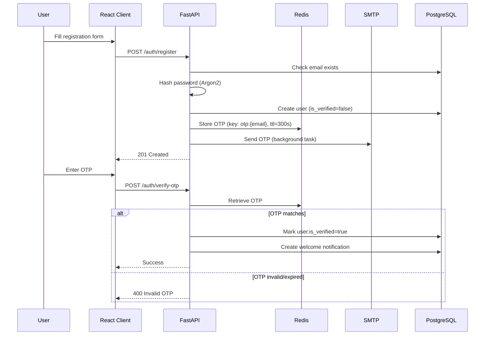
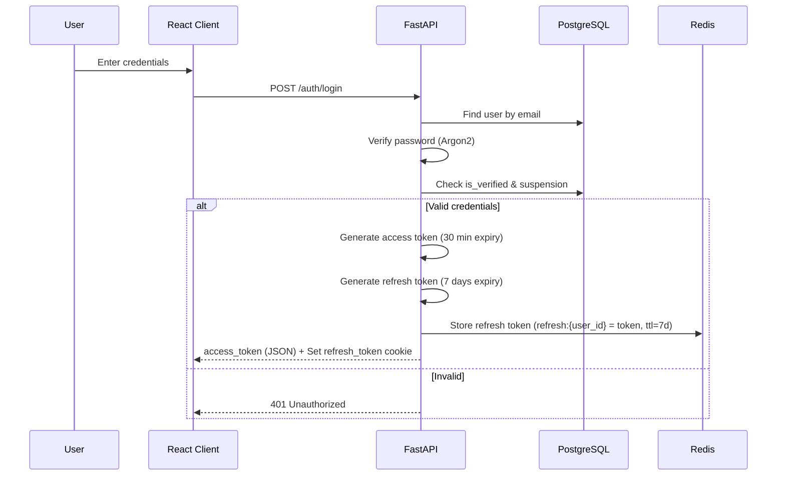
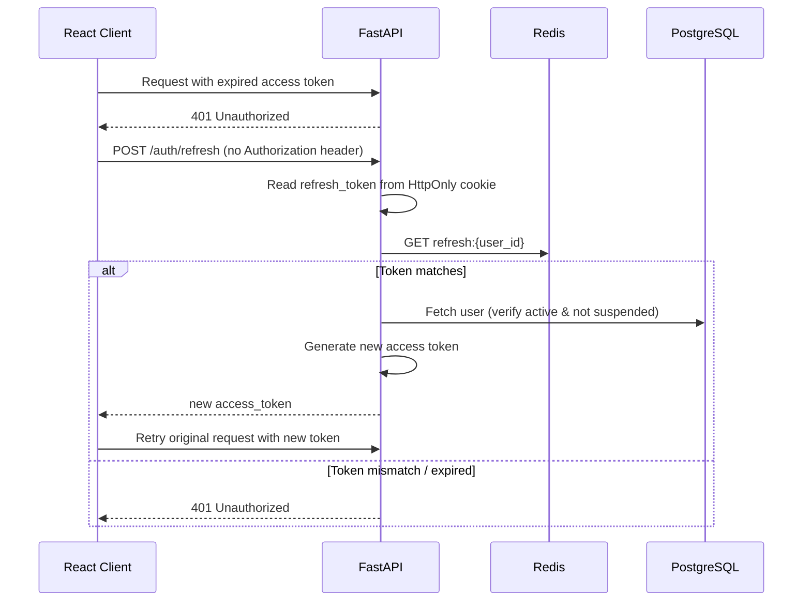
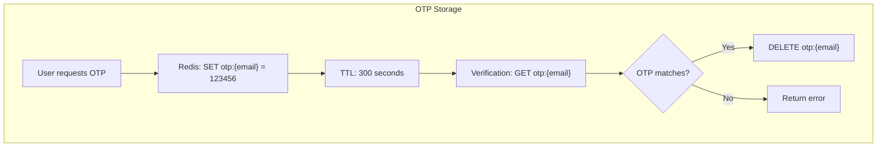
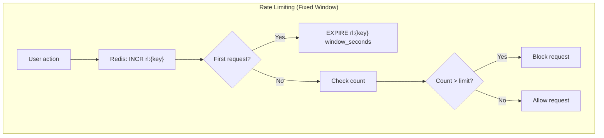

# Authentication & Security

The CMS Platform uses a **JWT‑based authentication system** with a dual‑token strategy (access + refresh) to balance security and user experience. All sensitive operations are protected by **rate limiting**, **secure cookies**, and **Argon2 password hashing**.

---

## Authentication Architecture

| Aspect | Implementation |
|--------|----------------|
| **Protocol** | JWT (JSON Web Tokens) |
| **Access Token** | Short‑lived (30 minutes), stored **only in RAM** on the frontend |
| **Refresh Token** | Long‑lived (7 days), stored in **HttpOnly, Secure, SameSite cookie** |
| **Password Hashing** | Argon2 (via `passlib`) |
| **OTP Storage** | Redis, TTL 5 minutes (registration) or 10 minutes (password reset) |
| **Rate Limiting** | Redis‑based fixed‑window counters |
| **Social Login** | Google OAuth 2.0 (ID token verification) |

---

## Registration & OTP Verification Flow

### Key Points

* OTP is generated as a random **6-digit number**
* Rate limiting on registration: **50 attempts per hour per email**
* OTP is sent via email using a **Jinja2 template**
* Welcome notification is created only after successful verification

---

## Login & Token Issuance

### Cookie Settings

* **HttpOnly** – Prevents JavaScript access (XSS protection)
* **Secure** – Sent only over HTTPS (set to `True` in production)
* **SameSite = Lax** – Protects against CSRF
* **Path = /** – Available for all endpoints

**Rate Limiting:** `50 attempts per hour per email` on login.

---

## Refresh Token Flow (Automatic)

When the access token expires, the frontend’s Axios interceptor automatically attempts a refresh.

> **Important:** The refresh token is **not rotated** — each user has a single valid refresh token. On logout, the token is deleted from Redis.

---

## Google OAuth Flow

1. Frontend loads Google Identity Services (via `@react-oauth/google`)
2. User clicks **Sign in with Google** — receives an ID token
3. Frontend sends `POST /auth/google` with `{ token_str: "..." }`
4. Backend verifies the token using Google’s public keys (via `google-auth`)
5. If the email is new, a user is created with `is_verified=True`
6. If the user exists, they are logged in
7. JWT pair is generated and returned (refresh token in cookie)

---

## Logout

`POST /auth/logout`

1. Reads the refresh token from the cookie
2. Deletes it from Redis (`refresh:{user_id}`)
3. Clears the cookie on the client side

The access token is **not explicitly revoked** — it expires after **30 minutes**.

---

## Redis Flow: OTP Storage & Rate Limiting

### Rate-Limited Endpoints & Limits

| Endpoint      | Key Pattern           | Limit | Window     |
| ------------- | --------------------- | ----- | ---------- |
| Registration  | `rl:reg:{email}`      | 50    | 1 hour     |
| Login         | `rl:login:{email}`    | 50    | 1 hour     |
| Resend OTP    | `rl:resend:{email}`   | 2     | 10 minutes |
| Submit Report | `rl:report:{user_id}` | 5     | 5 minutes  |

---

## Security Measures Summary

* **Password Hashing:** Argon2 (via `passlib`)
* **JWT Signing:** HS256 with separate secrets for access and refresh tokens
* **Token Expiry:** Short-lived access tokens minimise damage if compromised
* **HttpOnly Cookies:** Refresh token cannot be stolen by XSS
* **CORS:** Only trusted origins allowed
* **Rate Limiting:** Protects against brute-force and abuse
* **Suspension System:** Users can be temporarily suspended with automatic expiration
* **WebSocket Eviction:** On suspension, all active WebSocket connections are forcibly closed

---

## Environment Variables Required

| Variable                      | Purpose                             |
| ----------------------------- | ----------------------------------- |
| `SECRET_KEY`                  | Signing key for access tokens       |
| `REFRESH_SECRET_KEY`          | Signing key for refresh tokens      |
| `ACCESS_TOKEN_EXPIRE_MINUTES` | Access token TTL (default 30)       |
| `REFRESH_TOKEN_EXPIRE_DAYS`   | Refresh token TTL (default 7)       |
| `COOKIE_SECURE`               | Set to `True` in production (HTTPS) |
| `REDIS_URL`                   | Connection string for Redis         |
| `GOOGLE_CLIENT_ID`            | For Google OAuth verification       |
| `SMTP_*`                      | Gmail SMTP settings for OTP emails  |

---

This authentication system is designed to be **secure by default** while providing a seamless user experience. All flows are fully implemented in code and ready for production use.
