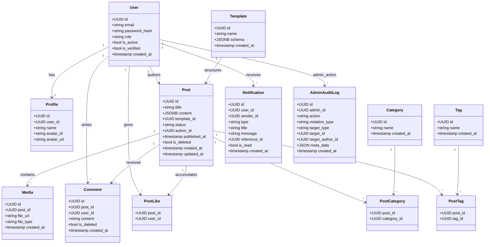
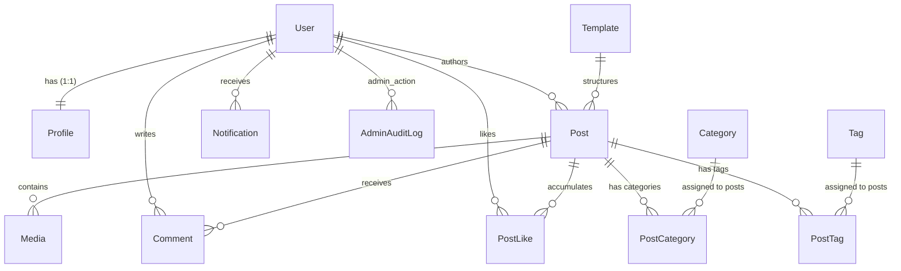

# Database Models & Schema

The database is built on **PostgreSQL** with **UUID** primary keys, **JSONB** fields for flexible content, and appropriate **indexes** for performance. All migrations are managed with **Alembic**.

---

## Class Diagram

The following class diagram shows all entity classes, their attributes (with types and visibility), and their relationships as defined in the SQLAlchemy models.

---

# ORM Relationship Diagram (Navigation View)

For clarity, here is the same set of relationships expressed in a more traditional ER-style Mermaid diagram, showing navigation paths and cardinalities as they appear in the SQLAlchemy models.

---

# Table Details

### `users`

| Column            | Type     | Constraints                 | Description            |
| ----------------- | -------- | --------------------------- | ---------------------- |
| id                | UUID     | PK                          | Primary key            |
| email             | String   | Unique, Indexed             | User's email address   |
| password_hash     | String   | Nullable (for Google users) | Argon2-hashed password |
| role              | Enum     | admin or author             | User role              |
| is_active         | Boolean  | Default True                | Soft-deletion flag     |
| is_verified       | Boolean  | Default False               | Email verified via OTP |
| created_at        | DateTime | Auto-set                    | Registration timestamp |
| is_suspended      | Boolean  | Default False               | Suspension flag        |
| suspended_until   | DateTime | Nullable                    | Expiry of suspension   |
| suspension_reason | String   | Nullable                    | Reason for suspension  |

---

### `profiles`

| Column     | Type   | Constraints                           | Description                              |
| ---------- | ------ | ------------------------------------- | ---------------------------------------- |
| id         | UUID   | PK                                    | Primary key                              |
| user_id    | UUID   | FK → users.id, Unique, Cascade Delete | Links to User                            |
| name       | String | Not Null                              | Display name                             |
| avatar_id  | String | Nullable                              | Preset avatar identifier (e.g., avatar1) |
| avatar_url | String | Nullable                              | Custom uploaded avatar URL               |

---

### `templates`

| Column     | Type     | Constraints      | Description                     |
| ---------- | -------- | ---------------- | ------------------------------- |
| id         | UUID     | PK               | Primary key                     |
| name       | String   | Unique, Not Null | Template name                   |
| schema     | JSONB    | Not Null         | Defines allowed blocks & limits |
| created_at | DateTime | Auto-set         | Creation timestamp              |

---

### `posts`

| Column       | Type     | Constraints                          | Description                        |
| ------------ | -------- | ------------------------------------ | ---------------------------------- |
| id           | UUID     | PK                                   | Primary key                        |
| title        | String   | Indexed, Not Null                    | Post title                         |
| content      | JSONB    | Not Null                             | Array of sections, columns, blocks |
| status       | String   | Indexed, Default draft               | draft or published                 |
| author_id    | UUID     | FK → users.id, Indexed, SET NULL     | Post author                        |
| template_id  | UUID     | FK → templates.id, Indexed, SET NULL | Template used                      |
| published_at | DateTime | Nullable                             | Timestamp of publication           |
| is_deleted   | Boolean  | Indexed, Default False               | Soft-delete flag                   |
| created_at   | DateTime | Auto-set                             | Creation timestamp                 |
| updated_at   | DateTime | Auto-update                          | Last update timestamp              |

---

### `categories` / `tags`

| Column     | Type     | Constraints               | Description        |
| ---------- | -------- | ------------------------- | ------------------ |
| id         | UUID     | PK                        | Primary key        |
| name       | String   | Unique, Indexed, Not Null | Category/Tag name  |
| created_at | DateTime | Auto-set                  | Creation timestamp |

---

### `post_categories` / `post_tags`

Junction tables with composite primary keys (`post_id`, `category_id` / `tag_id`).

Both foreign keys have `ON DELETE CASCADE`.

---

### `comments`

| Column     | Type     | Constraints                      | Description        |
| ---------- | -------- | -------------------------------- | ------------------ |
| id         | UUID     | PK                               | Primary key        |
| post_id    | UUID     | FK → posts.id, Indexed, CASCADE  | Parent post        |
| user_id    | UUID     | FK → users.id, Indexed, SET NULL | Comment author     |
| content    | Text     | Not Null                         | Comment text       |
| created_at | DateTime | Indexed, Auto-set                | Creation timestamp |

---

### `post_likes`

Composite primary key (`post_id`, `user_id`) — each user can like a post only once.

Both foreign keys have `ON DELETE CASCADE`.

---

### `media`

| Column      | Type     | Constraints                      | Description                  |
| ----------- | -------- | -------------------------------- | ---------------------------- |
| id          | UUID     | PK                               | Primary key                  |
| post_id     | UUID     | FK → posts.id, Not Null, CASCADE | Associated post              |
| file_url    | String   | Not Null                         | Azure Blob URL               |
| file_type   | String   | Not Null                         | MIME type (e.g., image/jpeg) |
| uploaded_by | UUID     | FK → users.id, SET NULL          | Uploader                     |
| created_at  | DateTime | Auto-set                         | Upload timestamp             |

---

### `notifications`

| Column       | Type     | Constraints                      | Description                   |
| ------------ | -------- | -------------------------------- | ----------------------------- |
| id           | UUID     | PK                               | Primary key                   |
| user_id      | UUID     | FK → users.id, Not Null, CASCADE | Recipient                     |
| sender_id    | UUID     | FK → users.id, SET NULL          | Action trigger                |
| type         | String   | Not Null                         | Event type (e.g., LIKE_EVENT) |
| title        | String   | Not Null                         | Short title                   |
| message      | String   | Not Null                         | Full message                  |
| reference_id | UUID     | Nullable                         | Related entity ID             |
| is_read      | Boolean  | Default False                    | Read status                   |
| created_at   | DateTime | Auto-set                         | Creation timestamp            |

---

### `reports`

| Column           | Type     | Constraints                        | Description                  |
| ---------------- | -------- | ---------------------------------- | ---------------------------- |
| id               | UUID     | PK                                 | Primary key                  |
| reporter_id      | UUID     | FK → users.id, Not Null, CASCADE   | Reporting user               |
| reported_user_id | UUID     | FK → users.id, CASCADE             | Target user                  |
| target_type      | String   | Not Null, Indexed                  | POST, COMMENT, or USER       |
| target_id        | UUID     | Not Null, Indexed                  | ID of reported entity        |
| violation_type   | Enum     | Not Null, Indexed                  | Type of violation            |
| details          | String   | Nullable                           | Additional details           |
| status           | Enum     | Not Null, Indexed, Default PENDING | PENDING, RESOLVED, DISMISSED |
| created_at       | DateTime | Not Null                           | Report timestamp             |

### Partial Unique Index

`idx_unique_pending_report` on `(reporter_id, target_id, target_type)` only when `status = 'PENDING'`.

Prevents duplicate active reports.

---

## `admin_audit_logs`

| Column           | Type     | Constraints             | Description                           |
| ---------------- | -------- | ----------------------- | ------------------------------------- |
| id               | UUID     | PK                      | Primary key                           |
| admin_id         | UUID     | FK → users.id, SET NULL | Admin who performed action            |
| action           | String   | Indexed, Not Null       | Action type (e.g., POST_SOFT_DELETED) |
| violation_type   | String   | Indexed, Default NONE   | Violation category                    |
| target_type      | String   | Indexed, Not Null       | Post, Comment, User                   |
| target_id        | UUID     | Indexed, Nullable       | Targeted entity ID                    |
| target_author_id | UUID     | FK → users.id, CASCADE  | Owner of target content               |
| meta_data        | JSON     | Nullable                | Additional context                    |
| created_at       | DateTime | Indexed, Not Null       | Action timestamp                      |

### Composite Index

`idx_admin_audit_logs_lookup` on
`(target_author_id, violation_type, created_at DESC)`

Used for efficient compliance queries.

---

# Key Relationships Summary

* **User ↔ Profile**: 1-to-1, cascade delete
* **User → Post**: 1-to-many (author)
* **User → Comment**: 1-to-many
* **User → PostLike**: 1-to-many (likes)
* **User → Notification**: 1-to-many (recipient) and sender
* **User → AdminAuditLog**: 1-to-many (admin + target author)
* **Template → Post**: 1-to-many
* **Post → Comment**: 1-to-many
* **Post → Media**: 1-to-many
* **Post → PostLike**: 1-to-many
* **Post ↔ Category**: many-to-many via `post_categories`
* **Post ↔ Tag**: many-to-many via `post_tags`

---

# Indexes & Performance Optimisation

All foreign keys are indexed.

Additional indexes:

* **posts**: `author_id`, `status`, `is_deleted`, `template_id`, `title`
* **comments**: `post_id`, `user_id`, `created_at`
* **notifications**: `user_id`, `created_at`
* **reports**: all filterable columns plus partial unique index
* **admin_audit_logs**: `admin_id`, `action`, `target_type`, `target_id`, `target_author_id`, `violation_type`, `created_at`, plus composite lookup index
