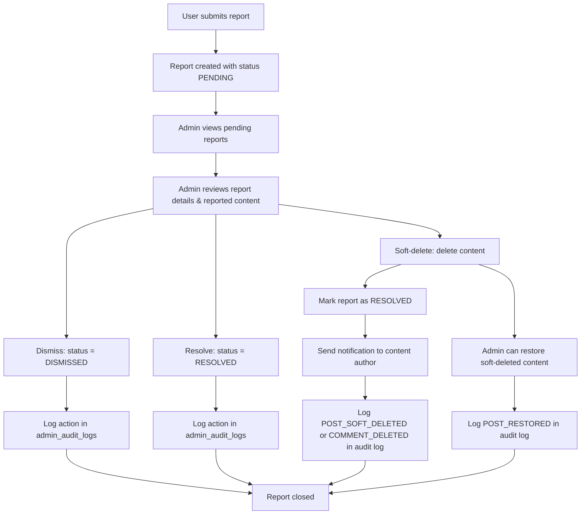

# Admin Moderation & Compliance

The CMS Platform includes a **full moderation suite** for administrators to maintain content quality, enforce community guidelines, and track all actions for compliance.

All admin endpoints are prefixed with `/admin` and require the **admin** role (enforced via `admin_only` dependency). Every moderation action is automatically logged in `admin_audit_logs` with full metadata.

---

## Moderation Capabilities

| Feature | Description | Endpoint |
|---------|-------------|----------|
| **Post Moderation** | Soft‑delete, hard‑delete, restore | `/admin/posts/{post_id}/soft-delete`, `/admin/posts/{post_id}/hard-delete`, `/admin/posts/{post_id}/restore` |
| **Comment Moderation** | Delete any comment (with reason) | `/admin/comments/{comment_id}` |
| **User Management** | Suspend, delete users | `/admin/users/{user_id}/suspend`, `/admin/users/{user_id}` |
| **Report Handling** | Dismiss, resolve, view reported content | `/admin/reports/{report_id}/dismiss`, `/admin/reports/{report_id}/resolve`, `/admin/reports/content/{target_type}/{target_id}` |
| **Audit Logs** | View all admin actions (filterable) | `/admin/audit-logs` |
| **Content Listing** | View all posts, authors, users (with filters) | `/admin/posts`, `/admin/authors`, `/admin/users` |

---

## Moderation / Report Workflow

The following diagram shows the complete lifecycle of a user‑submitted report, from creation to resolution.


### Key Points

* Reports are created with status **`PENDING`**
* Admins can view reported content (post, comment, or user) via
  `GET /admin/reports/content/{target_type}/{target_id}`
* Admins can **dismiss** a report (no violation found) or **resolve** it (violation confirmed but content already handled)
* If content is deleted via moderation, the associated report is automatically marked **`RESOLVED`**
* Content authors receive **real-time notifications** when their content is removed by an admin
* All moderation actions are recorded in the **audit log** with metadata (reason, violation type, admin ID, etc.)

---

## Audit Logging

Every admin action is stored in the `admin_audit_logs` table.

The `AuditLogService` (`app/services/audit_log.py`) provides a centralized interface for logging moderation events.

### Logged Actions

| Action                     | Description                              |
| -------------------------- | ---------------------------------------- |
| `POST_SOFT_DELETED`        | Post soft-deleted by admin               |
| `POST_HARD_DELETED`        | Post permanently deleted by admin        |
| `POST_RESTORED`            | Soft-deleted post restored               |
| `COMMENT_DELETED`          | Comment deleted by admin                 |
| `USER_SUSPENDED`           | User suspended by admin                  |
| `USER_HARD_DELETED`        | User permanently deleted by admin        |
| `REPORT_DISMISSED`         | Report dismissed (no violation)          |
| `REPORT_RESOLVED_MANUALLY` | Report resolved without content deletion |

---

## Audit Log Structure

| Field              | Type      | Description                                      |
| ------------------ | --------- | ------------------------------------------------ |
| `id`               | UUID      | Primary key                                      |
| `admin_id`         | UUID      | Admin who performed the action                   |
| `action`           | string    | Action type                                      |
| `violation_type`   | string    | Violation category (`HATE_SPEECH`, `SPAM`, etc.) |
| `target_type`      | string    | Post, Comment, or User                           |
| `target_id`        | UUID      | Affected entity ID                               |
| `target_author_id` | UUID      | Owner of affected content                        |
| `meta_data`        | JSON      | Extra context                                    |
| `created_at`       | timestamp | Action timestamp                                 |

### Composite Index

`idx_admin_audit_logs_lookup`

Composite index on:

```sql
(target_author_id, violation_type, created_at DESC)
```

Used for fast compliance queries such as:

> “Show all violations by user X.”

---

## Moderation Endpoints (Detailed)

### 1. Soft-Delete Post

```http
PATCH /admin/posts/{post_id}/soft-delete?reason=<string>&violation_type=<enum>&report_id=<optional>
```

Behavior:

* Sets `post.is_deleted = True`
* Marks report as `RESOLVED` if `report_id` is provided
* Sends notification to post author
* Logs `POST_SOFT_DELETED`

Example Request

```http
PATCH /admin/posts/123e4567-e89b-12d3-a456-426614174000/soft-delete?reason=Hate speech violation&violation_type=HATE_SPEECH&report_id=987fcdeb-51a2-4b3c-8d9e-0f1a2b3c4d5e
```

---

### 2. Hard-Delete Post

```http
DELETE /admin/posts/{post_id}/hard-delete?reason=<string>&violation_type=<enum>
```

Behavior:

* Permanently deletes post from database
* Logs `POST_HARD_DELETED`

---

### 3. Restore Post

```http
PATCH /admin/posts/{post_id}/restore
```

Behavior:

* Sets `post.is_deleted = False`
* Logs `POST_RESTORED`

---

### 4. Delete Comment (Admin)

```http
DELETE /admin/comments/{comment_id}?reason=<string>&violation_type=<enum>&report_id=<optional>
```

Behavior:

* Deletes comment
* Marks report as `RESOLVED` if `report_id` exists
* Sends notification to comment author
* Logs `COMMENT_DELETED`

---

### 5. Suspend User

```http
POST /admin/users/{user_id}/suspend?reason=<string>&violation_type=<enum>&hours=<int>
```

Behavior:

* Sets:

  * `is_suspended = True`
  * `suspended_until = now + hours`
  * `suspension_reason = reason`
* Sends email notification
* Evicts active WebSocket sessions
* Logs `USER_SUSPENDED`

Default suspension duration: **24 hours**

---

### 6. Delete User (Hard)

```http
DELETE /admin/users/{user_id}?reason=<string>&violation_type=<enum>
```

Behavior:

* Permanently deletes user
* PostgreSQL cascade removes related data
* Logs `USER_HARD_DELETED`

---

### 7. Dismiss Report

```http
PUT /admin/reports/{report_id}/dismiss
```

Request Body:

```json
{
  "reason": "No violation found"
}
```

Behavior:

* Sets `report.status = DISMISSED`
* Logs `REPORT_DISMISSED`

---

### 8. Resolve Report (Manually)

```http
PUT /admin/reports/{report_id}/resolve
```

Request Body:

```json
{
  "reason": "Violation confirmed, content already removed"
}
```

Behavior:

* Sets `report.status = RESOLVED`
* Logs `REPORT_RESOLVED_MANUALLY`

---

### 9. View Reported Content

```http
GET /admin/reports/content/{target_type}/{target_id}
```

Returns structured content for:

* Post
* Comment
* User

Used by admin dashboard for moderation review.

---

## Security & Compliance

* **Audit Trail** — Every moderation action is permanently logged
* **Notification** — Authors are informed when content is removed
* **Suspension** — Temporary user blocking with automatic expiry
* **WebSocket Eviction** — Active sessions are forcefully terminated upon suspension
* **Partial Unique Index** — Prevents duplicate active reports

---

## Admin Dashboard UI

The frontend provides a comprehensive moderation dashboard with the following sections:

### Dashboard

* Stats cards for:

  * Users
  * Posts
  * Pending reports
  * Audit logs

### Posts

* List all posts
* Filter by:

  * Status
  * Deleted state
* Actions:

  * Soft delete
  * Hard delete
  * Restore
  * View details

### Reports

* View pending reports
* Expand report details
* Inspect reported content
* Dismiss or resolve reports

### Audit Logs

* Complete moderation history
* Filter by:

  * Action
  * Violation type

### Users

* Tabs:

  * All
  * Active
  * Suspended
  * Inactive
* Actions:

  * Suspend
  * Delete

### Templates

* Create post templates
* Delete templates

### Categories

* Create categories
* Delete categories

All admin pages are protected by:

```jsx
<ProtectedRoute requiredRole="admin" />
```

---

The moderation system is designed for **transparency**, **accountability**, and **compliance**, ensuring all content decisions remain auditable and reversible when appropriate.