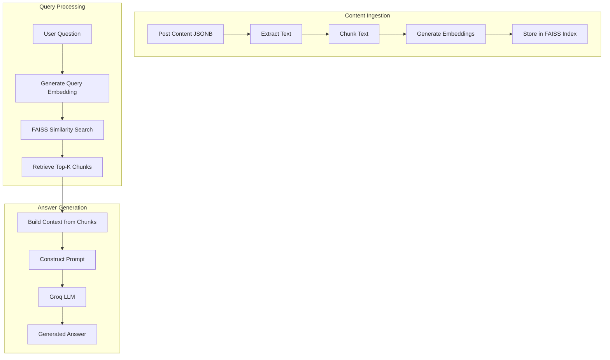
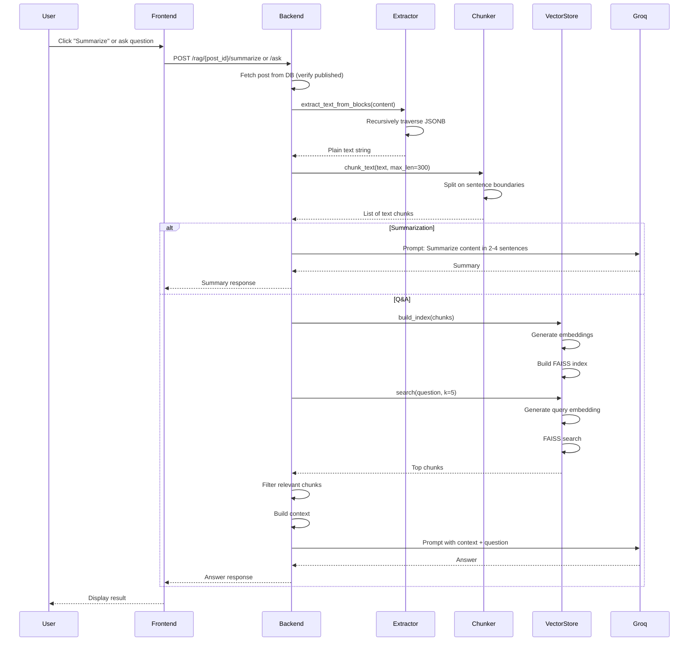

# RAG – AI Summarization & Q&A

The CMS Platform includes **AI-powered features** that allow users to:

- **Summarize** a published post in 2–4 sentences.
- **Ask natural language questions** about a post's content.

These features are powered by a **Retrieval-Augmented Generation (RAG)** pipeline that combines **semantic search** (via embeddings + FAISS) with **LLM generation** (via Groq).

---

## RAG Pipeline Overview



---

## Full RAG Sequence Diagram



---

## Component Details

### 1. Text Extractor (`extractor.py`)

The extractor recursively traverses the JSONB content structure (`sections → columns → blocks`) and collects all string values from relevant keys.

**Keys extracted:**

- `text`
- `content`
- `title`
- `description`
- `caption`
- `alt`

```python
def extract_text_from_blocks(content) -> str:
    text_parts = []

    def traverse(node):
        if isinstance(node, dict):
            for key in ["text", "content", "title", "description", "caption", "alt"]:
                if key in node and isinstance(node[key], str):
                    text_parts.append(node[key])

            for value in node.values():
                traverse(value)

        elif isinstance(node, list):
            for item in node:
                traverse(item)

    traverse(content)
    return "\n".join(text_parts)
```

---

### 2. Chunker (`chunker.py`)

Splits extracted text into sentence-based chunks using regex.

**Strategy:**

- Splits on `.`, `!`, or `?` followed by a space.
- Each chunk capped at `max_len` (default 300 chars).
- Sentences appended until limit reached.

```python
def chunk_text(text, max_len=300):
    sentences = re.split(r'(?<=[.!?]) +', text)
    chunks = []
    current = ""

    for sentence in sentences:
        if len(current) + len(sentence) < max_len:
            current += " " + sentence
        else:
            chunks.append(current.strip())
            current = sentence

    if current:
        chunks.append(current.strip())

    return chunks
```

---

### 3. Vector Store (`vectorstore.py`)

Manages embeddings and FAISS indexing.

#### Components

- **Embedding Model:** `all-MiniLM-L6-v2`
- 384-dimensional embeddings
- Fast CPU inference

**Vector Database:** FAISS CPU (`IndexFlatL2`)

#### Methods

- `build_index(chunks)`
- `search(query, k=3, return_scores=False)`

---

### 4. RAG Engine (`rag_engine.py`)

Orchestrates the entire pipeline and interfaces with Groq.

#### Groq Configuration

- Model: `llama-3.1-8b-instant`
- Temperature: `0.2–0.3`
- Max Tokens:
  - Summarization: `200`
  - Q&A: `500`

---

## Summarization

### Prompt Template

**System Prompt**

```text
You are an expert content summarizer. Create concise, informative summaries that capture the key points. Use clear, professional language.
```

**User Prompt**

```text
Provide a concise summary (2-4 sentences) of the following content, highlighting the main topics and key takeaways:

{text}
```

### Implementation

```python
def summarize_text(content) -> str:
    text = extract_text_from_blocks(content)

    if not text or not text.strip():
        raise ValueError("No text content found to summarize")

    if len(text.strip()) < 50:
        return text.strip()

    response = client.chat.completions.create(
        model="llama-3.1-8b-instant",
        messages=[
            {"role": "system", "content": "You are an expert content summarizer..."},
            {"role": "user", "content": f"Provide a concise summary...\n\n{text}"}
        ],
        temperature=0.3,
        max_tokens=200
    )

    return response.choices[0].message.content.strip()
```

### Edge Cases

- Empty content → `ValueError`
- Short content (< 50 chars) → Returned as-is
- Empty summary → `RuntimeError`

---

## Q&A (Question Answering)

### Retrieval Strategy

1. Retrieve top-5 chunks from FAISS
2. Filter chunks with L2 distance `< 2.0`
3. Use top 3 filtered chunks as context

### Prompt Template

**System**

```text
You are a knowledgeable assistant that provides accurate answers based strictly on the given context.
```

**User**

```text
Use ONLY the context provided below to answer the question.

CONTEXT:
{context}

QUESTION:
{question}

ANSWER:
```

### Implementation

```python
def ask_question(content, question: str) -> str:
    text = extract_text_from_blocks(content)
    chunks = chunk_text(text, max_len=400)

    store = VectorStore()
    store.build_index(chunks)

    results = store.search(question, k=5, return_scores=True)

    RELEVANCE_THRESHOLD = 2.0
    filtered_chunks = [
        chunk for chunk, score in results
        if score < RELEVANCE_THRESHOLD
    ]

    if not filtered_chunks:
        return "I couldn't find relevant information in this post."

    context = "\n\n".join(filtered_chunks[:3])

    response = client.chat.completions.create(
        model="llama-3.1-8b-instant",
        messages=[
            {"role": "system", "content": "You are a knowledgeable assistant..."},
            {"role": "user", "content": f"CONTEXT:\n{context}\n\nQUESTION:{question}"}
        ],
        temperature=0.2,
        max_tokens=500
    )

    return response.choices[0].message.content.strip()
```

---

## API Endpoints

### Summarize Post

```http
POST /rag/{post_id}/summarize
```

Response:

```json
{
  "success": true,
  "summary": "A concise summary..."
}
```

---

### Ask Question

```http
POST /rag/{post_id}/ask
```

Request:

```json
{
  "question": "What is the main argument presented in this post?"
}
```

Response:

```json
{
  "success": true,
  "answer": "The main argument is..."
}
```

---

## Validation

- Question length: 3–500 chars
- Only published posts may be queried

---

## Performance Considerations

| Aspect | Detail |
|---|---|
| Index Rebuilding | FAISS rebuilt per request |
| Embedding Model | `all-MiniLM-L6-v2` |
| Chunk Size | 300–400 chars |
| Relevance Threshold | L2 < 2.0 |
| Groq Rate Limits | Handled via try/catch |
| Error Handling | Generic 500 response |

---

## Environment Variables

| Variable | Purpose |
|---|---|
| `GROQ_API_KEY` | Groq API key |
| `EMBEDDING_MODEL` | Optional embedding override |

---

## Future Improvements

- Cache FAISS indexes per post
- Hybrid search (BM25 + semantic)
- Stream Groq responses
- Admin-customizable prompts

---

## Error Handling

| Error | Response |
|---|---|
| Post not found | 404 |
| Post not published | 403 |
| Empty content | 400 |
| Invalid question | 400 |
| Groq failure | 500 |
| Unexpected error | 500 |

---

The RAG pipeline provides a powerful AI assistant that enhances content consumption without requiring users to read entire long-form posts.