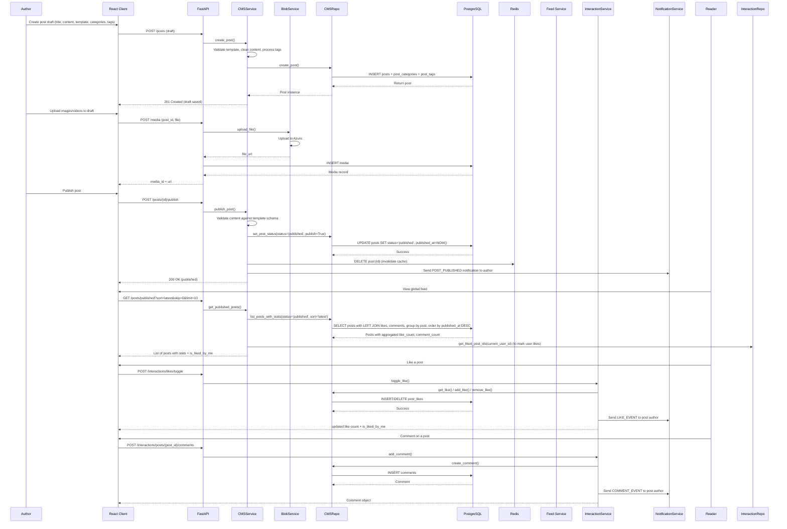
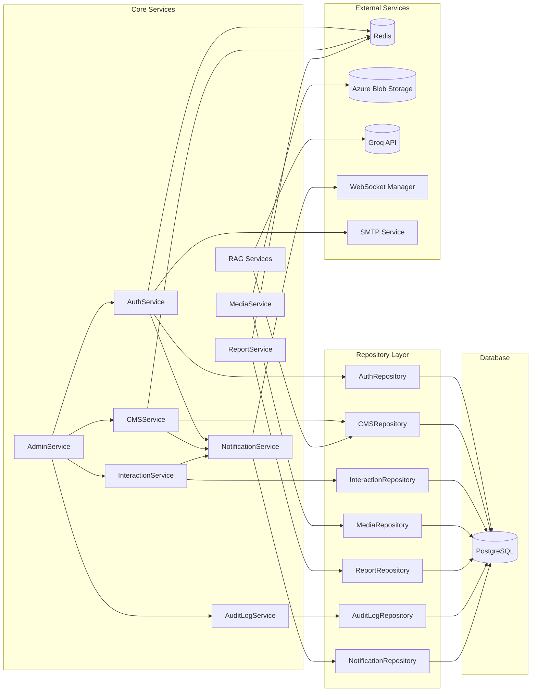

# Core Services & Business Logic

The service layer (`app/services/`) contains the **business logic** of the CMS Platform. Each service orchestrates repositories, external APIs, caching, and notifications. The services are **stateless** and depend on the database session and other services via dependency injection.

---

## Service Overview

| Service | File | Primary Responsibilities |
|---------|------|--------------------------|
| `AuthService` | `auth_service.py` | Registration, OTP, login, Google OAuth, password reset, suspension |
| `CMSService` | `cms_service.py` | Post CRUD, template validation, content cleaning, tag processing, caching |
| `InteractionService` | `interaction_service.py` | Comments (add/delete), likes (toggle), notifications on interactions |
| `MediaService` | `media_service.py` | Media record creation (after Azure upload) |
| `ReportService` | `report_service.py` | Report submission with rate limiting and duplicate prevention |
| `NotificationService` | `notification_service.py` | Creates DB notifications and pushes via WebSocket |
| `AuditLogService` | `audit_log.py` | Logs admin actions for compliance |
| `BlobService` | `blob_service.py` | Uploads files to Azure Blob Storage |
| `RAG Services` | `rag/` | Text extraction, chunking, vector search, LLM summarization/Q&A |

---

## Post Lifecycle / Feed Flow

The following diagram traces a post from **creation** to **publication** and then **rendering in the feed** with **interactions** (likes/comments).

---

# Service Layer Documentation

## Key Points

* **Draft creation** — No validation on content; tags are processed with dynamic tag creation
* **Media upload** — Only allowed if the post is in draft status
* **Publishing** — Content is validated against the template schema; invalid content prevents publishing
* **Feed** — Uses a single aggregated query (`list_posts_with_stats`) to avoid N+1 queries
* **Like / Comment** — Notifications are sent only if the actor is not the post author
* **Caching** — `GET /posts/{id}` caches the serialized post in Redis for **30 seconds**

---

# Detailed Service Descriptions

### 1. AuthService (`auth_service.py`)

Handles all authentication-related operations.

| Method                                                                | Description                                                                                                     |
| --------------------------------------------------------------------- | --------------------------------------------------------------------------------------------------------------- |
| `register_user(data, bg_tasks)`                                       | Validates email, creates unverified user, stores OTP in Redis (5-min TTL), sends email as background task       |
| `verify_otp(data)`                                                    | Verifies OTP, marks user as verified, creates welcome notification                                              |
| `login_user(data)`                                                    | Checks credentials and suspension; generates access & refresh tokens; stores refresh token in Redis (7-day TTL) |
| `google_auth_callback(token_str)`                                     | Verifies Google ID token; creates or updates user (`is_verified=True`); returns JWT pair                        |
| `resend_otp(email, bg_tasks)`                                         | Rate-limited (2 per 10 min); generates new OTP and sends email                                                  |
| `send_forgot_password_otp(db, email)`                                 | Stores OTP (10-min TTL), sends reset email                                                                      |
| `reset_password_with_otp(db, email, otp, new_password)`               | Verifies OTP, hashes password, updates user                                                                     |
| `suspend_user_account(db, target_user_id, reason, hours, admin_user)` | Sets suspension flags, sends email, evicts WebSocket connections                                                |

### 2. CMSService (`cms_service.py`)

Manages posts, templates, and caching.

| Method                                                        | Description                                                                                   |
| ------------------------------------------------------------- | --------------------------------------------------------------------------------------------- |
| `create_post(db, data, author_id)`                            | Validates template, cleans content, processes dynamic tags, creates post                      |
| `get_post(db, post_id, current_user_id)`                      | Tries Redis cache; on miss fetches from DB, serializes, caches (30 sec), computes like status |
| `update_post(db, post_id, data, user_id)`                     | Validates ownership, cleans content, updates tags, invalidates cache                          |
| `publish_post(db, post_id, user_id)`                          | Validates content against schema, marks published, clears cache, sends notification           |
| `soft_delete_post(db, post_id, current_user)`                 | Admin-only delete of others’ posts; logs action and sends admin notification                  |
| `hard_delete_post(db, post_id, current_user)`                 | Permanently deletes post (author only)                                                        |
| `unpublish_post(db, post_id, author_id)`                      | Moves post back to draft                                                                      |
| `get_published_posts(db, current_user_id, skip, limit, sort)` | Returns feed with aggregated stats and like status                                            |
| `get_my_published(db, current_user_id, skip, limit)`          | Returns author’s published posts                                                              |
| `get_my_drafts(db, current_user_id, skip, limit)`             | Returns author’s draft posts                                                                  |

### Key Internal Helpers

* `_process_dynamic_tags()` — Normalizes tags, creates missing tags, returns tag UUIDs
* `_serialize_post_with_stats()` — Serializes post with:

  * `like_count`
  * `comment_count`
  * `is_liked_by_me`

### 3. InteractionService (`interaction_service.py`)

Handles comments and likes with real-time notifications.

| Method                                         | Description                                                                               |
| ---------------------------------------------- | ----------------------------------------------------------------------------------------- |
| `add_comment(db, post_id, user_id, data)`      | Verifies post exists and is published; creates comment; sends notification to post author |
| `remove_comment(db, comment_id, current_user)` | Only comment author or admin can delete; admin deletion triggers notification             |
| `get_post_comments(db, post_id, skip, limit)`  | Returns comments with user profile details                                                |
| `toggle_like(db, post_id, user_id)`            | Adds or removes like; sends notification if liked                                         |

### 4. MediaService (`media_service.py`)

Simple service for media records after Azure upload.

| Method                                                | Description           |
| ----------------------------------------------------- | --------------------- |
| `create_media(file_url, file_type, user_id, post_id)` | Inserts a `Media` row |

### 5. ReportService (`report_service.py`)

| Method                                          | Description                                                                                                       |
| ----------------------------------------------- | ----------------------------------------------------------------------------------------------------------------- |
| `file_new_report(current_user_id, report_data)` | Prevents self-reporting, enforces rate limiting (5 per 5 min), prevents duplicate pending reports, creates report |

### 6. NotificationService (`notification_service.py`)

| Method                                                                                      | Description                                      |
| ------------------------------------------------------------------------------------------- | ------------------------------------------------ |
| `create_and_send_notification(db, user_id, sender_id, ntype, title, message, reference_id)` | Creates DB notification and pushes via WebSocket |

### 7. AuditLogService (`audit_log.py`)

| Method                                                                                                       | Description                                 |
| ------------------------------------------------------------------------------------------------------------ | ------------------------------------------- |
| `log_admin_event(db, action, target_type, admin_id, target_id, target_author_id, violation_type, meta_data)` | Creates and stores an `AdminAuditLog` entry |

### 8. BlobService (`blob_service.py`)

Handles Azure Blob Storage uploads.

| Method                                  | Description                                                     |
| --------------------------------------- | --------------------------------------------------------------- |
| `upload_file(file, user_id)`            | Uploads to `{user_id}/{uuid}_{filename}` and returns public URL |
| `upload_profile_picture(file, user_id)` | Uploads avatar images to `profile-pictures/{user_id}/...`       |

### 9. RAG Services (`rag.py`)

For complete implementation details, please refer to the [RAG – AI Summarization & Q&A](/docs/backend/rag) page.

---

## Complete Service Dependency Diagram

---

## Explanation of Dependencies

| Service                 | Dependencies                                                                                                                              |
| ----------------------- | ----------------------------------------------------------------------------------------------------------------------------------------- |
| **AuthService**         | `AuthRepository`, Redis (OTP, refresh tokens, rate limiting), SMTP Email Service, `NotificationService` (welcome notifications)           |
| **CMSService**          | `CMSRepository`, `InteractionRepository` (for like/comment counts), Redis (caching), `NotificationService`                                |
| **InteractionService**  | `InteractionRepository`, `NotificationService`                                                                                            |
| **MediaService**        | `MediaRepository`, BlobService (Azure upload)                                                                                             |
| **ReportService**       | `ReportRepository`, Redis (rate limiting)                                                                                                 |
| **AuditLogService**     | `AuditLogRepository`                                                                                                                      |
| **RAG Services**        | `CMSRepository` (fetch posts), Groq API (LLM), SentenceTransformers + FAISS (vector search)                                               |
| **NotificationService** | `NotificationRepository`, WebSocket Manager                                                                                               |
| **AdminService**        | Combines `AuthService` (suspension), `CMSService` (soft/hard delete), `InteractionService` (delete comments), `AuditLogService` (logging) |

---

## Architectural Notes

* Each service encapsulates a **single business domain** and communicates through repositories or other services.
* Repositories abstract all **database access**, preventing raw SQL from leaking into service logic.
* External systems such as Redis, Azure Blob Storage, SMTP, and Groq are treated as infrastructure dependencies.
* `AdminService` acts as an orchestration layer for moderation workflows that span multiple domains.

---

## Testing & Maintainability

* Each service is **stateless**, making unit testing easier with mocked repositories and external dependencies

* Business logic is isolated from:

  * **HTTP concerns** (Routers)
  * **Persistence concerns** (Repositories)

* This layered design enables easy infrastructure replacement
  Example:

  * Switch from **Azure Blob Storage** to **Amazon S3**
  * Replace **Redis** with another caching layer
    without major service-level refactoring
