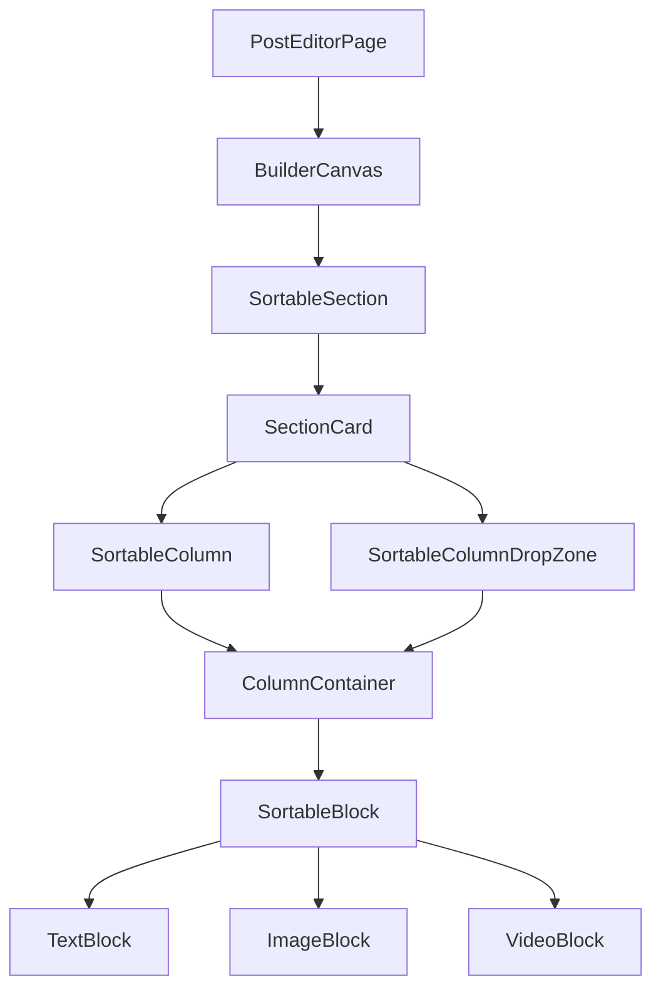

# UI Components & Design

The frontend is built from **reusable, modular components** organized by domain. This section covers the most important component groups and their responsibilities.

---

## Component Organization

Components live in `src/components/` and are grouped by function:

```text
components/
├── auth/             # Login, Register, OTP, Google button
├── cms/              # Post builder, feed, media, templates
│   ├── blocks/       # TextBlock, ImageBlock, VideoBlock
│   ├── builder/      # BuilderCanvas, SectionCard, ColumnContainer
│   ├── dnd/          # Sortable wrappers for drag-and-drop
│   ├── feed/         # PostCardItem, CommentSection, PostDetailPage
│   ├── media/        # MediaUploader, MediaLibraryDialog
│   └── template/     # TemplateCard, TemplateSelectionDialog
├── common/           # ProtectedRoute, GuestRoute, ConfirmDialog
├── landing/          # Hero, Features, Workflow, CTA sections
├── navigation/       # Navbar, Sidebar, NotificationMenu, ProfileMenu
└── workspace/        # Workspace dashboard cards
```

---

## Post Builder (CMS)

The most complex UI is the **post editor**, which follows a nested structure:

```text
Post
└── Sections (sortable)
    └── Columns (sortable)
        └── Blocks (sortable, draggable between columns)
            ├── Text Block (TipTap rich text)
            ├── Image Block (upload or library pick)
            └── Video Block (upload or library pick)
```

### Component Hierarchy



### Key Components

| Component | File | Responsibility |
| --- | --- | --- |
| BuilderCanvas | `builder/BuilderCanvas.tsx` | Top-level DnD context, manages sections |
| SectionCard | `builder/SectionCard.tsx` | Renders section and handles block drag between columns |
| ColumnContainer | `builder/ColumnContainer.tsx` | Renders blocks inside column |
| TextBlock | `blocks/TextBlock.tsx` | TipTap rich text editor |
| ImageBlock | `blocks/ImageBlock.tsx` | Image uploader + picker |
| VideoBlock | `blocks/VideoBlock.tsx` | Video uploader + picker |
| SortableSection / Column / Block | `dnd/` | dnd-kit wrappers |

---

## Feed & Interactions

The feed displays published posts with interactive capabilities.

| Component | File | Responsibility |
| --- | --- | --- |
| PostCardItem | `feed/PostCardItem.tsx` | Feed preview card |
| PostDetailPage | `feed/PostDetailPage.tsx` | Full post view |
| PostRenderer | `render/PostRenderer.tsx` | Renders post layout |
| CommentSection | `feed/CommentSection.tsx` | Nested comments |
| CommentItem | `feed/CommentItem.tsx` | Single comment |
| ReportDialog | `feed/ReportDialog.tsx` | Report modal |
| SummarizeDialog | `feed/SummarizeDialog.tsx` | AI summary modal |
| AskQuestionDialog | `feed/AskQuestionDialog.tsx` | AI Q&A modal |

---

## Admin Panels

Admin components are located in `pages/admin/`.

| Component | File | Responsibility |
| --- | --- | --- |
| AdminDashboardPage | `pages/admin/AdminDashboardPage.tsx` | Stats dashboard |
| PostsPage | `pages/admin/PostsPage.tsx` | Post moderation |
| ReportsPage | `pages/admin/ReportsPage.tsx` | Report handling |
| AuditLogsPage | `pages/admin/AuditLogsPage.tsx` | Audit logs |
| UserManagementPage | `pages/admin/UserManagementPage.tsx` | User management |
| TemplatesPage | `pages/admin/TemplatesPage.tsx` | Template CRUD |
| CategoriesPage | `pages/admin/CategoriesPage.tsx` | Category CRUD |

### Common UI Patterns

- Tables with pagination and sorting
- Action dialogs (delete, suspend, dismiss)
- Formik forms with Yup validation
- Chips and badges for status indication

---

## Landing Page

The public landing page uses animated sections via **Framer Motion**.

| Component | File | Responsibility |
| --- | --- | --- |
| LandingNavbar | `Landing/LandingNavbar.tsx` | Top navigation |
| HeroSection | `Landing/HeroSection.tsx` | Hero section |
| FeaturesGrid | `Landing/FeaturesGrid.tsx` | Feature cards |
| WorkflowSection | `Landing/WorkflowSection.tsx` | Workflow steps |
| TrustMetrics | `Landing/TrustMetrics.tsx` | Metrics |
| CTASection | `Landing/CTASection.tsx` | Call-to-action |
| Footer | `Landing/Footer.tsx` | Footer |

---

## Navigation & Layout

| Component | File | Responsibility |
| --- | --- | --- |
| Sidebar | `navigation/Sidebar.tsx` | Collapsible sidebar |
| Navbar | `navigation/Navbar.tsx` | Top navigation bar |
| NotificationMenu | `navigation/NotificationMenu.tsx` | Notifications dropdown |
| ProfileMenu | `navigation/ProfileMenu.tsx` | User menu |

---

## Common Components

Reusable across the entire app.

| Component | File | Responsibility |
| --- | --- | --- |
| ProtectedRoute | `common/ProtectedRoute.tsx` | Route guard |
| GuestRoute | `common/GuestRoute.tsx` | Guest-only routes |
| ConfirmDialog | `common/ConfirmDialog.tsx` | Confirmation modal |
| LoadingScreen | `common/LoadingScreen.tsx` | Loading spinner |
| EmptyState | `common/EmptyState.tsx` | Empty placeholder |

---

## Reusable Patterns

- **Form Management:** Formik + Yup validation  
- **API Calls:** Service layer (`authService`, `cmsService`, etc.)  
- **Toast Notifications:** React Hot Toast  
- **Modals:** MUI Dialog  
- **Responsive Design:** MUI Grid, Stack, Box  

---

## Theming

The app supports **light and dark modes** via MUI `ThemeProvider`. Colors and gradients are customized in `theme/theme.ts` and controlled via `ThemeContext`.

### Key UI Principles

- Consistent spacing and typography (**Inter** font)
- Smooth micro-interactions
- Accessibility (contrast ratios, focus states)

---

This component architecture ensures **reusability, testability, and consistency** across the entire application.