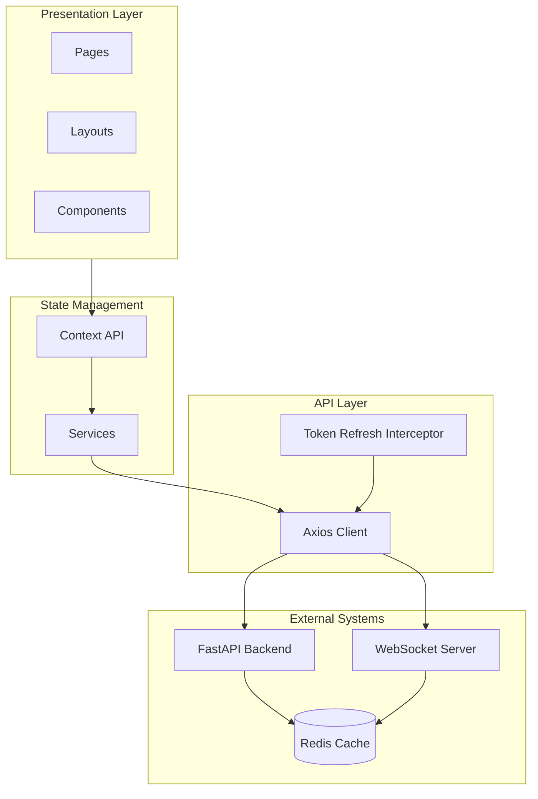

# Frontend Overview

The frontend is a **React 19** Single Page Application built with **TypeScript** and **Vite**. It delivers a responsive, intuitive content management experience with live updates and a drag-and-drop post builder.

---

## Architecture at a Glance



---

## Technology Stack

| Area | Technology | Purpose |
| --- | --- | --- |
| Framework | React 19 + TypeScript | UI & type safety |
| Build Tool | Vite | Fast development & builds |
| UI Library | Material UI (MUI) | Components & theming |
| Drag & Drop | dnd-kit | Post builder interactions |
| Rich Text | TipTap | Text block editor |
| Forms | Formik + Yup | Form state & validation |
| HTTP Client | Axios | API calls with auto refresh |
| Routing | React Router v7 | Navigation & protected routes |
| Animations | Framer Motion | UI transitions |
| Live Updates | WebSocket API | Push notifications |

---

## Project Structure

```text
src/
├── api/            # API clients
├── components/     # Reusable UI components
│   ├── auth/
│   ├── cms/
│   ├── common/
│   ├── landing/
│   └── navigation/
├── context/
├── layouts/
├── pages/
├── services/
├── theme/
├── types/
└── utils/
```

---

## Key Features

### ✏️ Post Builder

- Drag-and-drop sections, columns, and blocks
- Template-driven structure with configurable limits
- Auto-save to localStorage
- Real-time preview mode

### 📰 Global Feed

- Infinite scroll with pagination
- Sorting by latest, likes, comments, popular
- Search by title
- Like/comment counts and avatars

### 🖼️ Media Library

- Upload images/videos to Azure Blob
- Reuse existing media
- Image and video preview support

### 🔔 Live Notifications

- Persistent WebSocket connection per user
- Notifications for likes, comments, admin actions
- Unread count badges
- Click to navigate to relevant page

### 🛡️ Admin Panels

- Dashboard statistics
- Post moderation
- Report handling
- Audit logs
- User management
- Template/category management

---

## State Management

Three context providers handle global state:

| Context | Responsibility |
| --- | --- |
| AuthContext | User auth, tokens, login/logout |
| NotificationContext | Notifications, WebSocket, unread count |
| ThemeContext | Dark/light mode |

> **Security Note:** Access tokens are stored only in RAM (never localStorage) to reduce XSS risk. Refresh tokens are stored in `HttpOnly`, `Secure`, `SameSite` cookies.

---

## Routing

Protected routes use `ProtectedRoute` with role-based access.

| Route | Access | Description |
| --- | --- | --- |
| `/` | Public | Landing page |
| `/auth/*` | Guest | Login, Register, OTP |
| `/app/*` | Author | Workspace, Feed, Editor |
| `/admin/*` | Admin | Dashboard, Reports, Users |

---

## Build Commands

```bash
npm run dev      # Development server
npm run build    # Production build
npm run lint     # ESLint
npm run preview  # Preview production build
```

---

The frontend prioritizes developer productivity through strong typing, modular components, and clean separation of concerns while delivering a polished user experience.