# Pages & Routing

The CMS Platform uses **React Router v7** for client-side routing. Routes are organized by access level and role, with nested layouts for consistent UI.

---

## Route Hierarchy

```mermaid
flowchart TD
    Root["/"] --> Landing["LandingPage (Public)"]

    Root --> Auth["/auth (GuestRoute)"]
    Auth --> Login["/login"]
    Auth --> AdminLogin["/admin/login"]
    Auth --> Register["/register"]

    Root --> AuthShared["/auth (AuthLayout)"]
    AuthShared --> Verify["/verify-otp"]
    AuthShared --> Forgot["/forgot-password"]
    AuthShared --> Reset["/reset-password"]

    Root --> AuthorApp["/app (ProtectedRoute, role=author)"]
    AuthorApp --> Workspace["/workspace"]
    AuthorApp --> Editor["/workspace/editor/:postId?"]
    AuthorApp --> MyContent["/my-content"]
    AuthorApp --> Drafts["/drafts"]
    AuthorApp --> Feed["/feed"]
    AuthorApp --> Categories["/categories"]
    AuthorApp --> Media["/media"]
    AuthorApp --> Notifications["/notifications"]
    AuthorApp --> Profile["/profile"]
    AuthorApp --> Settings["/settings"]
    AuthorApp --> PostDetail["/posts/:postId"]

    Root --> AdminApp["/admin (ProtectedRoute, role=admin)"]
    AdminApp --> Dashboard["/dashboard"]
    AdminApp --> AdminPosts["/posts"]
    AdminApp --> Reports["/reports"]
    AdminApp --> AuditLogs["/audit-logs"]
    AdminApp --> Templates["/templates"]
    AdminApp --> AdminCategories["/categories"]
    AdminApp --> Users["/users"]
```



---

## Route Groups

### 🟢 Public Routes (Guest Only)

These pages are accessible without authentication. Logged-in users are redirected away.

| Route | Component | Description |
| --- | --- | --- |
| `/` | `LandingPage` | Marketing landing page |
| `/auth/login` | `LoginPage` | Author login form |
| `/admin/login` | `AdminLoginPage` | Admin login form |
| `/auth/register` | `RegisterPage` | Registration form |

---

### 🟡 Semi-Public (AuthLayout)

These routes use the `AuthLayout` but are accessible to both guests and authenticated users.

| Route | Component | Description |
| --- | --- | --- |
| `/auth/verify-otp` | `VerifyOtpPage` | OTP verification |
| `/auth/forgot-password` | `ForgotPasswordPage` | Request password reset OTP |
| `/auth/reset-password` | `ResetPasswordPage` | Reset password with OTP |

---

### 🔵 Author Routes (`/app/*`)

Protected by `ProtectedRoute` with `requiredRole="author"`.

| Route | Component | Description |
| --- | --- | --- |
| `/app/workspace` | `WorkspacePage` | Dashboard and quick actions |
| `/app/workspace/editor` | `PostEditorPage` | New post editor |
| `/app/workspace/editor/:postId` | `PostEditorPage` | Edit draft |
| `/app/my-content` | `MyContentPage` | Published posts |
| `/app/drafts` | `DraftsPage` | Draft posts |
| `/app/feed` | `FeedPage` | Global feed |
| `/app/categories` | `CategoriesPage` | Discover content |
| `/app/media` | `MediaLibraryPage` | Uploaded media |
| `/app/notifications` | `NotificationsPage` | Notification list |
| `/app/profile` | `ProfilePage` | Profile page |
| `/app/settings` | `SettingsPage` | User settings |
| `/app/posts/:postId` | `PostDetailPage` | Full post view |

---

### 🔴 Admin Routes (`/admin/*`)

Protected by `ProtectedRoute` with `requiredRole="admin"`.

| Route | Component | Description |
| --- | --- | --- |
| `/admin/dashboard` | `AdminDashboardPage` | Stats overview |
| `/admin/posts` | `AdminPostsPage` | Moderate posts |
| `/admin/reports` | `AdminReportsPage` | Handle reports |
| `/admin/audit-logs` | `AdminAuditLogsPage` | Compliance logs |
| `/admin/templates` | `AdminTemplatesPage` | Template CRUD |
| `/admin/categories` | `AdminCategoriesPage` | Category CRUD |
| `/admin/users` | `AdminUserManagementPage` | Manage users |

---

## Layouts

The app uses three layout components to provide consistent UI.

### AuthLayout

Used for `/auth/*`.

Structure:

- Left: branding, features, theme toggle
- Right: auth form content

---

### AuthorLayout

Used for `/app/*`.

Includes:

- Collapsible sidebar
- Top navbar
- Notification menu
- Profile menu
- Theme toggle
- Page outlet

---

### AdminLayout

Used for `/admin/*`.

Includes:

- Admin sidebar
- Top bar
- Theme toggle
- Logout
- Page outlet

---

## ProtectedRoute Implementation

```tsx
// components/common/ProtectedRoute.tsx
export default function ProtectedRoute({
  children,
  requiredRole
}: Props) {
  const { user, isAuthenticated, isInitializing } = useAuth();

  if (isInitializing) return <LoadingScreen />;

  if (!isAuthenticated) {
    return (
      <Navigate
        to={requiredRole === "admin"
          ? "/admin/login"
          : "/auth/login"}
        replace
      />
    );
  }

  if (requiredRole && user?.role !== requiredRole) {
    return (
      <Navigate
        to={user?.role === "admin"
          ? "/admin/dashboard"
          : "/app/workspace"}
        replace
      />
    );
  }

  return <>{children}</>;
}
```

---

## Page Components

All page components live in `src/pages/`.

```text
pages/
├── LandingPage.tsx
├── auth/
│   ├── LoginPage.tsx
│   ├── AdminLoginPage.tsx
│   ├── RegisterPage.tsx
│   ├── VerifyOtpPage.tsx
│   ├── ForgotPasswordPage.tsx
│   └── ResetPasswordPage.tsx
├── author/
│   ├── WorkspacePage.tsx
│   ├── PostEditorPage.tsx
│   ├── MyContentPage.tsx
│   ├── DraftsPage.tsx
│   ├── FeedPage.tsx
│   ├── CategoriesPage.tsx
│   ├── MediaLibraryPage.tsx
│   ├── NotificationsPage.tsx
│   ├── ProfilePage.tsx
│   └── SettingsPage.tsx
└── admin/
    ├── AdminDashboardPage.tsx
    ├── AdminPostsPage.tsx
    ├── AdminReportsPage.tsx
    ├── AdminAuditLogsPage.tsx
    ├── AdminTemplatesPage.tsx
    ├── AdminCategoriesPage.tsx
    └── AdminUserManagementPage.tsx
```

---

## URL Design Principles

- **Resource-based:** `/posts/123`, `/users/456`
- **Nested for context:** `/app/workspace/editor/:postId`
- **Clear access boundaries:** `/app` for authors, `/admin` for admins
- **Consistent naming:** `my-content`, `drafts`, `report-status`

---

The routing system is designed to be **secure, intuitive, and scalable**, making it easy to add new pages while maintaining clear access controls.