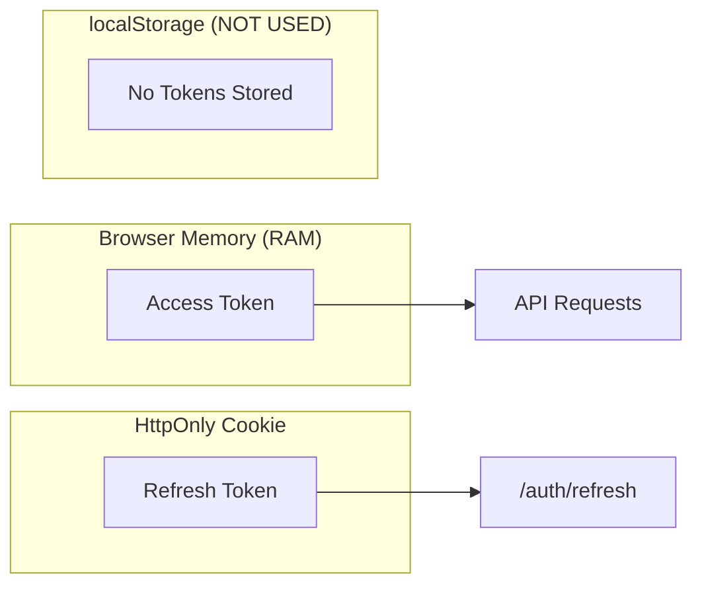
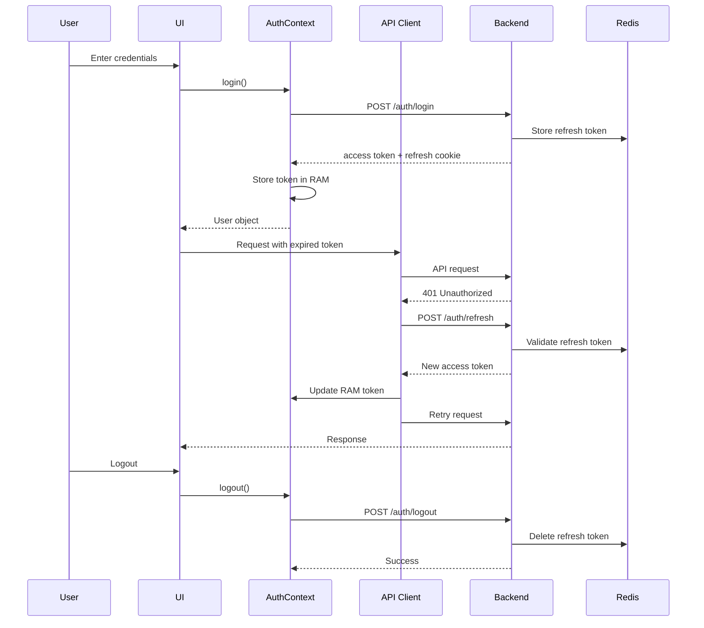
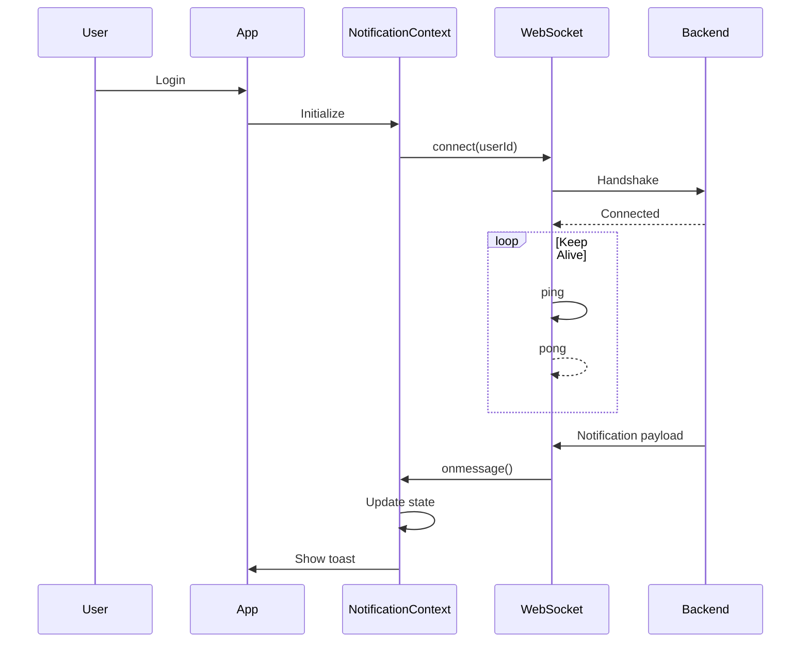
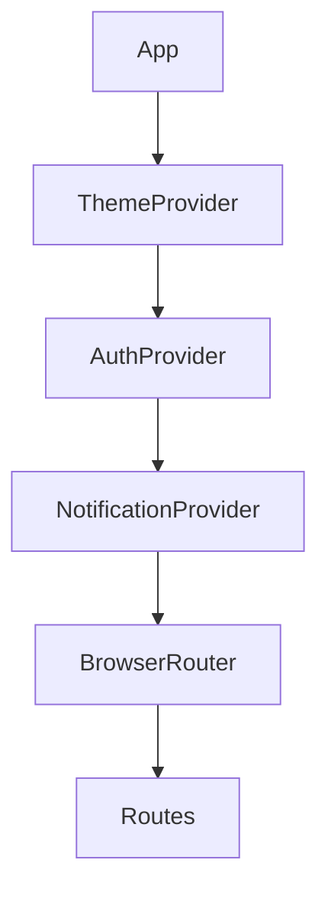

# State Management

The CMS Platform uses **React Context API** for global state management. This lightweight built-in solution is sufficient for the application without requiring external libraries like Redux.

Three context providers manage different domains of application state:

| Context | Provider | Responsibility |
| --- | --- | --- |
| **Auth** | `AuthContext` | Authentication, tokens, login/logout, session restoration |
| **Notification** | `NotificationContext` | Notifications, WebSocket connection, unread count |
| **Theme** | `ThemeContext` | Dark/light mode preference |

---

## AuthContext — Authentication State

The `AuthContext` manages user authentication and token lifecycle.

### State Shape

```typescript
interface AuthState {
  user: User | null;
  accessToken: string | null;
  isAuthenticated: boolean;
  isInitializing: boolean;
}
```

### Key Functions

| Function | Description |
| --- | --- |
| `login(email, password)` | Authenticate user and store access token |
| `loginWithGoogle(token)` | Authenticate using Google OAuth |
| `logout()` | Clear tokens and reset state |
| `restoreSession()` | Silent refresh using cookie |

---

## Security: Token Storage Strategy



### Why This Matters

- Access token in RAM → reduces XSS risk
- Refresh token in HttpOnly cookie → inaccessible to JavaScript
- No tokens in localStorage → avoids persistent token theft

---

## Authentication Flow



---

## Axios Interceptor

```typescript
axiosInstance.interceptors.response.use(
  (response) => response,
  async (error) => {
    const originalRequest = error.config;

    if (
      error.response?.status === 401 &&
      !originalRequest._retry
    ) {
      originalRequest._retry = true;

      try {
        const response = await axios.post(
          "/auth/refresh",
          {},
          { withCredentials: true }
        );

        const newToken = response.data.access_token;
        tokenService.setAccessToken(newToken);

        originalRequest.headers.Authorization =
          `Bearer ${newToken}`;

        return axiosInstance(originalRequest);
      } catch {
        tokenService.clearTokens();
        return Promise.reject(error);
      }
    }

    return Promise.reject(error);
  }
);
```

---

## NotificationContext — Live Updates

The `NotificationContext` manages notifications, WebSocket connection, and unread count.

### State Shape

```typescript
interface NotificationState {
  notifications: Notification[];
  unreadCount: number;
}
```

### Key Functions

| Function | Description |
| --- | --- |
| `refreshNotifications()` | Fetch latest notifications |
| `markAsRead(id)` | Mark single notification |
| `markAllAsRead()` | Mark all notifications |

---

## WebSocket Connection Flow



---

## Notification Payload

```json
{
  "id": "550e8400-e29b-41d4-a716-446655440000",
  "type": "LIKE_EVENT",
  "title": "New Interaction",
  "message": "John liked your post.",
  "reference_id": "123e4567-e89b-12d3-a456-426614174000",
  "created_at": "2026-06-24T10:30:00Z",
  "is_read": false
}
```

### Notification Types

| Type | Trigger | Navigation |
| --- | --- | --- |
| `WELCOME` | OTP verification | Workspace |
| `POST_PUBLISHED` | User publishes post | My Content |
| `POST_DELETION_BYADMIN` | Admin soft-delete | My Content |
| `COMMENT_EVENT` | New comment | Post detail |
| `LIKE_EVENT` | New like | Post detail |
| `COMMENT_DELETION_BYADMIN` | Admin deletes comment | Notifications |

---

## Unread Count Badge

Unread count is computed as:

```typescript
notifications.filter((n) => !n.is_read).length;
```

Displayed in:

- Sidebar
- Navbar
- Notifications page

---

## ThemeContext — Dark / Light Mode

The `ThemeContext` manages theme preference and persists it in localStorage.

### State Shape

```typescript
interface ThemeState {
  darkMode: boolean;
}
```

### Key Functions

| Function | Description |
| --- | --- |
| `toggleTheme()` | Toggle theme |
| `darkMode` | Current theme state |

---

## Persistence

```typescript
const [darkMode, setDarkMode] = useState(() => {
  const stored = localStorage.getItem("theme");
  return stored === "dark";
});

useEffect(() => {
  localStorage.setItem(
    "theme",
    darkMode ? "dark" : "light"
  );
}, [darkMode]);
```

---

## Theme Application

```typescript
export const lightTheme = createTheme({});
export const darkTheme = createTheme({});

<MuiThemeProvider
  theme={darkMode ? darkTheme : lightTheme}
>
  {children}
</MuiThemeProvider>;
```

---

## localStorage Usage

The frontend uses localStorage for:

| Key | Purpose | Data |
| --- | --- | --- |
| `theme` | Theme preference | `"dark"` / `"light"` |
| `cms-post-{postId}` | Draft autosave | Post data |
| `cms-unsaved-template-{templateId}` | Unsaved template draft | Post data |

Draft behavior:

- Auto-saved on every change
- Restored when reopening editor
- Cleared after publish

Templates are temporarily stored in `sessionStorage`.

---

## Provider Hierarchy



### Order Matters

- **ThemeProvider** → provides MUI theme
- **AuthProvider** → manages auth state
- **NotificationProvider** → depends on auth
- **Router** → uses auth for route guards

---

## Summary

| Context | Storage | WebSocket | localStorage |
| --- | --- | --- | --- |
| Auth | RAM + HttpOnly cookie | ❌ | ❌ |
| Notification | RAM | ✅ | ❌ |
| Theme | RAM | ❌ | ✅ |

The state management design is secure, performant, and easy to reason about, keeping the frontend fast and maintainable.