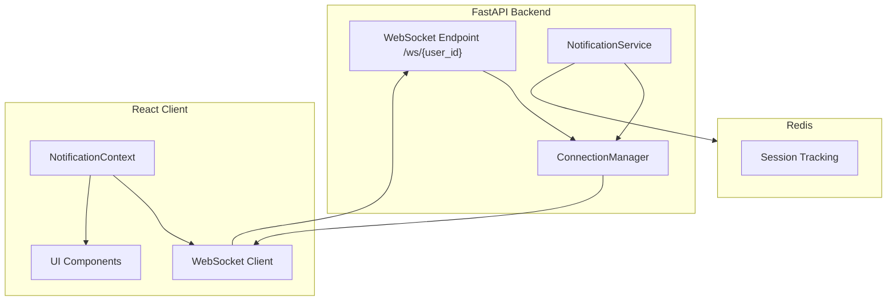
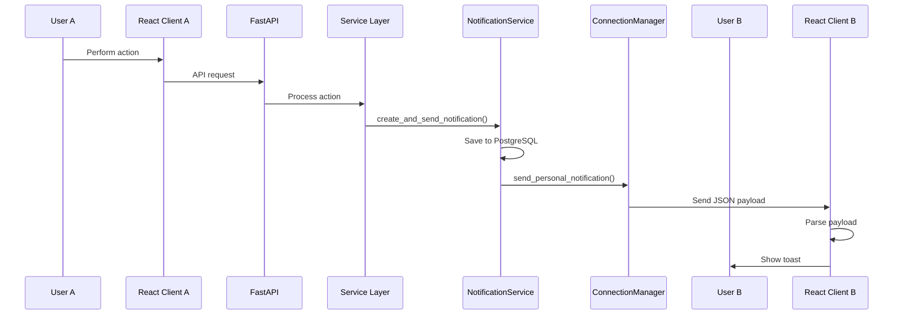

# WebSocket Real-Time System

The CMS Platform uses **WebSockets** to push live notifications to connected clients. This enables instant feedback for interactions such as likes, comments, and admin actions without requiring polling or page refreshes.

---

## Architecture Overview



---

## Connection Manager

The `ConnectionManager` class (`app/utils/websocket_manager.py`) manages all active WebSocket connections.

### Data Structure

```python
class ConnectionManager:
    active_connections: Dict[str, List[WebSocket]]
```

- **Key:** `user_id`
- **Value:** List of WebSocket objects (supports multiple tabs)

---

### Key Methods

| Method | Description |
| --- | --- |
| `connect(user_id, websocket)` | Accepts connection and stores socket |
| `disconnect(user_id, websocket)` | Removes specific socket |
| `send_personal_notification(user_id, payload)` | Sends payload to all user sockets |
| `evict_user(user_id)` | Force-close all sockets |

---

## Multiple Tab Support

Because users may open multiple browser tabs, the manager stores a **list of sockets per user**. Notifications are broadcast to all active tabs.

---

## WebSocket Endpoint

**Endpoint**

```text
ws://localhost:8000/api/v1/notifications/ws/{user_id}
```

### Authentication

Authentication is not enforced during the handshake. The frontend connects only after login, so access is implicitly authenticated.

---

## Endpoint Handler

```python
@router.websocket("/ws/{user_id}")
async def websocket_endpoint(websocket: WebSocket, user_id: str):
    await notification_manager.connect(user_id, websocket)

    try:
        while True:
            message = await websocket.receive_text()
            if message == "ping":
                await websocket.send_text("pong")
    except WebSocketDisconnect:
        notification_manager.disconnect(user_id, websocket)
```

### Keep-Alive

- Client sends `"ping"` every 30 seconds
- Server responds with `"pong"`
- Disconnect automatically cleans connection map

---

## Notification Flow



---

## Notification Payload

```json
{
  "id": "550e8400-e29b-41d4-a716-446655440000",
  "type": "LIKE_EVENT",
  "title": "New Interaction",
  "message": "John liked your post 'My Latest Article'.",
  "reference_id": "123e4567-e89b-12d3-a456-426614174000",
  "created_at": "2026-06-24T10:30:00Z",
  "is_read": false
}
```

---

## Event Types & Triggers

| Event Type | Trigger | Recipient |
| --- | --- | --- |
| `WELCOME` | OTP verification | New user |
| `POST_PUBLISHED` | Author publishes post | Author |
| `POST_DELETION_BYADMIN` | Admin soft-delete | Post author |
| `COMMENT_EVENT` | New comment | Post author |
| `LIKE_EVENT` | New like | Post author |
| `COMMENT_DELETION_BYADMIN` | Admin deletes comment | Comment author |

> Notifications are never sent to the actor themselves.

---

## Frontend Integration

### WebSocket Client (`notificationSocket.ts`)

The frontend uses a singleton socket manager.

```typescript
class NotificationSocket {
  private socket: WebSocket | null = null;

  connect(
    userId: string,
    onNotification: (notification: Notification) => void
  ) {
    this.socket = new WebSocket(
      `ws://localhost:8000/api/v1/notifications/ws/${userId}`
    );

    this.socket.onmessage = (event) => {
      if (event.data === "pong") return;

      const notification = JSON.parse(event.data);
      onNotification(notification);
    };

    this.socket.onopen = () => {
      setInterval(() => {
        if (this.socket?.readyState === WebSocket.OPEN) {
          this.socket.send("ping");
        }
      }, 30000);
    };
  }

  disconnect() {
    this.socket?.close();
  }
}
```

---

## NotificationContext Integration

```typescript
useEffect(() => {
  if (!user) return;

  notificationSocket.connect(user.id, (notification) => {
    setNotifications((prev) => [notification, ...prev]);
    toast.success(notification.title);
  });

  return () => notificationSocket.disconnect();
}, [user]);
```

---

## Notification Menu

Features:

- Dropdown showing latest 10 notifications
- Unread count badge
- Mark-as-read support
- Click to navigate to relevant page

---

## Security: WebSocket Eviction

When an admin suspends a user, all active sockets are forcefully closed.

```python
await notification_manager.evict_user(str(user.id))
```

`evict_user()` sends a security payload before closing sockets.

### Security Payload

```json
{
  "type": "SECURITY_EVICTION",
  "title": "Account Status Changed",
  "message": "Your session must be re-authenticated."
}
```

This prevents suspended users from continuing to receive live updates.

---

## Performance Considerations

### Connection Scalability

The in-memory `active_connections` map works well for moderate traffic. For horizontal scaling, use Redis Pub/Sub or a message broker.

### Keep-Alive

Ping/pong prevents idle timeout.

### Payload Size

Payloads remain intentionally small to minimize bandwidth.

---

## Future Enhancements

- Redis Pub/Sub for horizontal scaling
- Typing indicators for collaboration
- Read receipts
- Delivery acknowledgements

---

The WebSocket system delivers reliable, low-latency notifications that keep users engaged and informed about relevant activity.