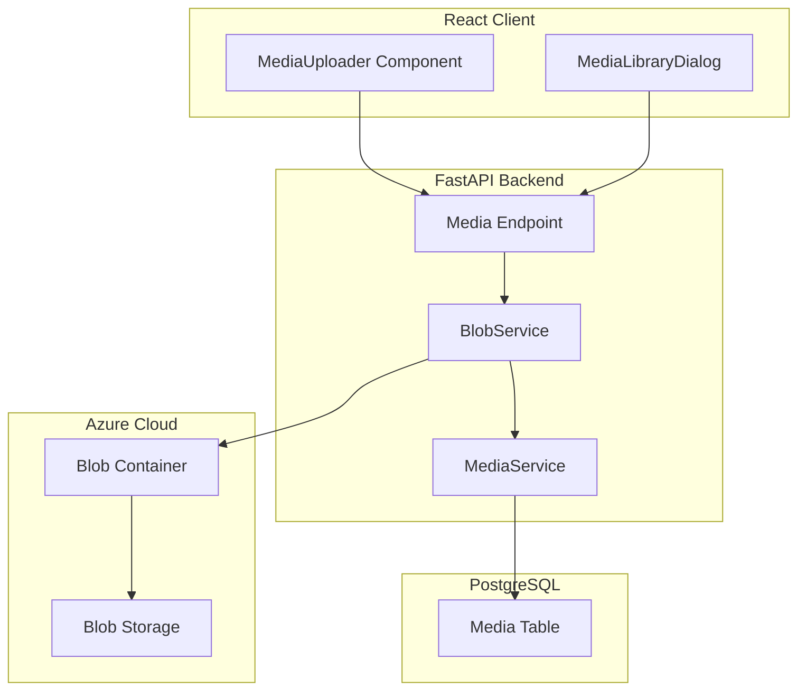
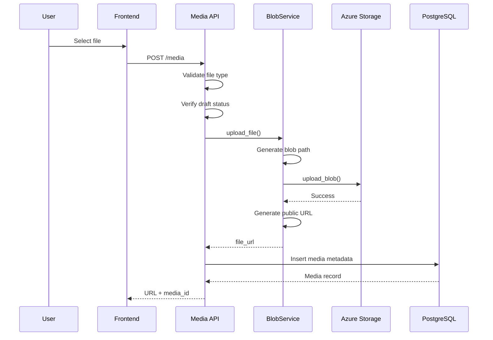
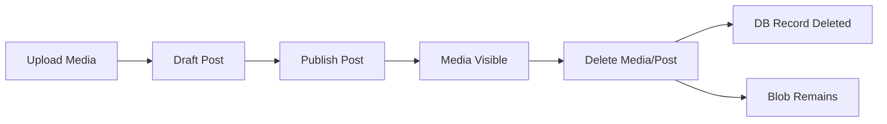

# Azure Blob Storage

The CMS Platform uses **Azure Blob Storage** for storing all user-uploaded media — images, videos, and profile pictures. This provides a scalable, cost-effective storage solution with CDN-ready URLs.

---

## Architecture Overview



---

## Configuration

Azure Blob Storage is configured using environment variables in `app/core/config.py`.

| Variable | Purpose |
| --- | --- |
| `AZURE_CONNECTION_STRING` | Azure storage connection string |
| `AZURE_CONTAINER_NAME` | Blob container name |

Example `.env`:

```env
AZURE_CONNECTION_STRING=DefaultEndpointsProtocol=https;AccountName=myaccount;AccountKey=...
AZURE_CONTAINER_NAME=cms-media
```

---

## Blob Path Structure

Paths are generated using `app/utils/blob_storage.py`.

### General Media

```text
{user_id}/{uuid4()}_{original_filename}
```

Example:

```text
123e4567-e89b-12d3-a456-426614174000/a1b2c3d4_sunset.jpg
```

### Profile Pictures

```text
profile-pictures/{user_id}/{uuid4()}_{original_filename}
```

Example:

```text
profile-pictures/123e4567/avatar.png
```

### Path Generation Code

```python
def generate_blob_path(filename: str, user_id: str) -> str:
    file_name = f"{uuid4()}_{filename}"
    return f"{user_id}/{file_name}"

def generate_profile_picture_blob_path(
    filename: str,
    user_id: str
) -> str:
    file_name = f"{uuid4()}_{filename}"
    return f"profile-pictures/{user_id}/{file_name}"
```

---

## Upload Flow



---

## File Type Validation

Allowed file types:

### General Media
- `image/jpeg`
- `image/png`
- `video/mp4`

### Profile Pictures
- `image/jpeg`
- `image/png`
- `image/webp`

```python
allowed_types = [
    "image/jpeg",
    "image/png",
    "video/mp4"
]

if file.content_type not in allowed_types:
    raise HTTPException(
        status_code=400,
        detail="Invalid file type"
    )
```

---

## URL Generation

Public blob URLs are constructed as:

```text
https://{account_name}.blob.core.windows.net/{container_name}/{blob_path}
```

Code:

```python
def generate_blob_url(
    account_name: str,
    blob_path: str
) -> str:
    return (
        f"https://{account_name}.blob.core.windows.net/"
        f"{settings.AZURE_CONTAINER_NAME}/{blob_path}"
    )
```

> No SAS tokens are currently used. Blobs are publicly readable, but UUID-based paths make guessing difficult.

---

## Frontend Integration

### MediaUploader Component

```tsx
const handleUpload = async (
  event: React.ChangeEvent<HTMLInputElement>
) => {
  const file = event.target.files?.[0];
  if (!file || !postId) return;

  const formData = new FormData();
  formData.append("post_id", postId);
  formData.append("file", file);

  const response =
    await mediaApi.uploadMedia(formData);

  onUploaded({
    media_id: response.media_id,
    url: response.url
  });
};
```

---

### MediaLibraryDialog

```tsx
const loadMedia = async () => {
  const data = await mediaService.getMyMedia();

  const filtered = data.filter(item =>
    mediaType === "image"
      ? item.file_type.startsWith("image/")
      : item.file_type.startsWith("video/")
  );

  setMedia(filtered);
};
```

---

## Media Lifecycle



### Key Points

- Media can only be uploaded to draft posts
- Published post media becomes public
- Deleting media removes DB record only
- Azure blob cleanup is manual

---

## Media API Endpoints

| Method | Endpoint | Description |
| --- | --- | --- |
| `POST` | `/media/` | Upload media |
| `GET` | `/media/post/{post_id}` | Get post media |
| `GET` | `/media/` | Get user media |
| `PUT` | `/media/{media_id}` | Replace media |
| `DELETE` | `/media/{media_id}` | Delete media |

---

## Security Considerations

### File Validation
Only safe image/video MIME types are allowed.

### Ownership Checks
Users can upload or delete media only for their own draft posts.

### Draft Restriction
Media modifications are allowed only while post status is `draft`.

### Public URLs
UUID-based paths reduce discoverability.

### Size Limits
Currently not enforced; can be added via middleware or Azure policies.

---

## Performance Optimizations

### Direct Uploads
Files are streamed directly to Azure without disk storage.

### CDN Ready
Azure Blob supports CDN integration for global delivery.

### No Image Processing
Images are stored as-is.

---

## Future Improvements

- SAS token support
- Automatic image compression
- WebP generation
- Azure CDN integration
- Automatic orphan cleanup

---

The Azure Blob Storage integration provides a scalable and cost-effective media storage solution with clean separation between blob storage and database metadata.